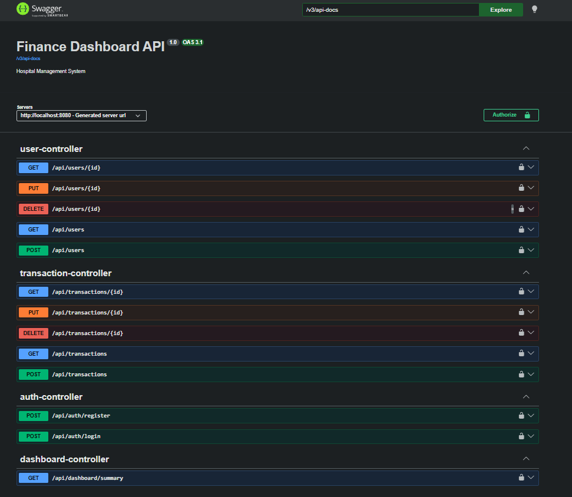

# Finance Dashboard – Backend REST API

A secure, role-based **Finance Dashboard REST API** built with **Spring Boot 3**, **Spring Security**, and **JWT authentication**. Designed as a backend assessment project, it provides endpoints for authentication, transaction management, user administration, and a financial summary dashboard.

---

## Tech Stack

| Layer | Technology |
|---|---|
| Language | Java 21 |
| Framework | Spring Boot 3.5.13 |
| Security | Spring Security + JWT (JJWT 0.11.5) |
| Persistence | Spring Data JPA + H2 (in-memory) |
| Validation | Jakarta Bean Validation |
| API Docs | SpringDoc OpenAPI / Swagger UI |
| Build Tool | Maven |
| Utilities | Lombok |

---

## Project Structure

```
dashboard/
├── src/main/java/com/finance/dashboard/
│   ├── config/
│   │   ├── DataInitializer.java       # Seeds default users & transactions on startup
│   │   ├── SecurityConfig.java        # Spring Security & role-based authorization rules
│   │   └── SwaggerConfig.java         # OpenAPI / Swagger configuration
│   ├── controller/
│   │   ├── AuthController.java        # Login & registration endpoints
│   │   ├── TransactionController.java # CRUD for transactions
│   │   ├── UserController.java        # User management (ADMIN only)
│   │   └── DashboardController.java   # Financial summary endpoint
│   ├── dto/
│   │   ├── request/                   # LoginRequest, RegisterRequest, TransactionRequest, UserUpdateRequest
│   │   └── response/                  # ApiResponse, AuthResponse, TransactionResponse, UserResponse, DashboardResponse
│   ├── entity/
│   │   ├── User.java
│   │   └── Transaction.java
│   ├── enums/
│   │   ├── Role.java                  # ADMIN | ANALYST | VIEWER
│   │   └── TransactionType.java       # INCOME | EXPENSE
│   ├── exception/
│   │   ├── GlobalExceptionHandler.java
│   │   ├── AccessDeniedException.java
│   │   ├── BadRequestException.java
│   │   ├── DuplicateResourceException.java
│   │   └── ResourceNotFoundException.java
│   ├── mapper/
│   │   └── UserMapper.java
│   ├── repository/
│   │   ├── UserRepository.java
│   │   └── TransactionRepository.java
│   ├── security/
│   │   ├── JwtAuthFilter.java
│   │   ├── JwtUtil.java
│   │   └── UserDetailsServiceImpl.java
│   ├── service/
│   │   ├── UserService.java
│   │   ├── TransactionService.java
│   │   └── DashboardService.java
│   └── DashboardApplication.java
└── src/main/resources/
    └── application.yaml
```

---

## Getting Started

### Prerequisites

- Java 21+
- Maven 3.8+

### Run the Application

```bash
# Clone the repository
git clone <your-repo-url>
cd dashboard

# Build and run
./mvnw spring-boot:run
```

The server starts on **http://localhost:8080**

---

## Default Seeded Users

On startup, the `DataInitializer` automatically seeds the following users:

| Username | Password | Role |
|---|---|---|
| `admin` | `admin123` | ADMIN |
| `analyst` | `analyst123` | ANALYST |
| `viewer` | `viewer123` | VIEWER |

Sample transactions (income & expense) are also seeded for the admin user.

---

## API Endpoints

### Authentication (`/api/auth`) – Public

| Method | Endpoint | Description |
|---|---|---|
| POST | `/api/auth/login` | Login and receive JWT token |
| POST | `/api/auth/register` | Register a new user |

**Login Request:**
```json
{
  "username": "admin",
  "password": "admin123"
}
```

**Login Response:**
```json
{
  "success": true,
  "message": "Login successful",
  "data": {
    "token": "<jwt-token>",
    "tokenType": "Bearer",
    "username": "admin",
    "email": "admin@finance.com",
    "role": "ADMIN"
  }
}
```

---

### Transactions (`/api/transactions`)

| Method | Endpoint | Role Required | Description |
|---|---|---|---|
| POST | `/api/transactions` | ADMIN | Create a transaction |
| GET | `/api/transactions` | ADMIN, ANALYST, VIEWER | List transactions (paginated, filtered) |
| GET | `/api/transactions/{id}` | ADMIN, ANALYST, VIEWER | Get transaction by ID |
| PUT | `/api/transactions/{id}` | ADMIN | Update a transaction |
| DELETE | `/api/transactions/{id}` | ADMIN | Delete a transaction |

**GET `/api/transactions` – Query Parameters:**

| Parameter | Type | Description |
|---|---|---|
| `type` | `INCOME` / `EXPENSE` | Filter by type |
| `category` | String | Filter by category |
| `startDate` | `yyyy-MM-dd` | Date range start |
| `endDate` | `yyyy-MM-dd` | Date range end |
| `page` | int (default: 0) | Page number |
| `size` | int (default: 10) | Page size |
| `sortBy` | String (default: `date`) | Sort field |
| `sortDir` | `asc` / `desc` | Sort direction |

---

### Users (`/api/users`) – ADMIN only

| Method | Endpoint | Description |
|---|---|---|
| POST | `/api/users` | Create a new user |
| GET | `/api/users` | Get all users (optional `?role=` filter) |
| GET | `/api/users/{id}` | Get user by ID |
| PUT | `/api/users/{id}` | Update user |
| DELETE | `/api/users/{id}` | Deactivate user |

---

### Dashboard (`/api/dashboard`)

| Method | Endpoint | Role Required | Description |
|---|---|---|---|
| GET | `/api/dashboard/summary` | ADMIN, ANALYST, VIEWER | Get financial summary |

Returns total income, total expenses, net balance, and transaction counts.

---

## API Documentation (Swagger UI)



---

## Role-Based Access Control

| Resource | ADMIN | ANALYST | VIEWER |
|---|---|---|---|
| Auth (login/register) | ✅ | ✅ | ✅ |
| Create / Update / Delete Transactions | ✅ | ❌ | ❌ |
| View Transactions | ✅ | ✅ | ✅ |
| User Management | ✅ | ❌ | ❌ |
| Dashboard Summary | ✅ | ✅ | ✅ |

---

## Authentication

All protected endpoints require a JWT token in the `Authorization` header:

```
Authorization: Bearer <your-jwt-token>
```

Tokens are valid for **24 hours** (configurable via `app.jwt.expiration`).

---

## API Documentation (Swagger UI)

Once the app is running, visit:

```
http://localhost:8080/swagger-ui.html
```

The Swagger UI allows you to explore and test all endpoints interactively. Use the **Authorize** button to enter your Bearer token.

---

## H2 In-Memory Database Console

```
http://localhost:8080/h2-console
```

| Field | Value |
|---|---|
| JDBC URL | `jdbc:h2:mem:financedb` |
| Username | `sa` |
| Password | *(leave empty)* |

> Note: The database resets on every application restart (`ddl-auto: create-drop`).

---

## Configuration

Key settings in `src/main/resources/application.yaml`:

```yaml
server:
  port: 8080

app:
  jwt:
    secret: <hex-encoded-secret>
    expiration: 86400000   # 24 hours in milliseconds
```

---

## Error Handling

All errors follow a consistent API response format:

```json
{
  "success": false,
  "message": "Resource not found",
  "data": null
}
```

Custom exceptions handled globally via `GlobalExceptionHandler`:
- `ResourceNotFoundException` → 404
- `DuplicateResourceException` → 409
- `BadRequestException` → 400
- `AccessDeniedException` → 403
- Validation errors → 400 with field-level messages
